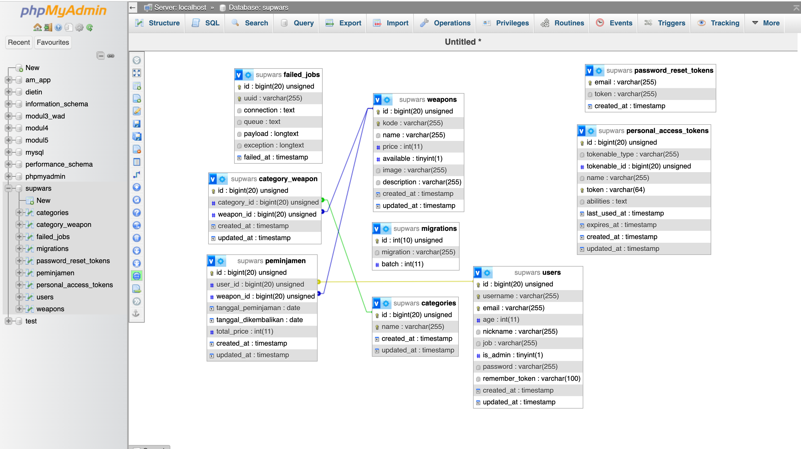

# DOAIBU GROUP

## Nama team

-   Muhammad Nurul Afif Maliki
-   Ataya Najla

## SupWar

A cutting-edge application revolutionizing military weapon management. SupWar streamlines the process of firearm lending for military personnel, ensuring efficient and secure weapon transactions. The app facilitates seamless tracking of weapon assignments, enhancing troop readiness. With features like real-time inventory updates, user authentication, and detailed weapon logs, SupWar ensures precision in weapon allocation and retrieval. This innovative tool prioritizes accountability, security, and operational readiness for military forces worldwide.

## Features

-   Login
-   Register
-   2 Roles
-   Peminjaman Senjata
-   Admin page
-   All Requirement Needed in Wa Group

## Database

## Screen Record

https://drive.google.com/file/d/1CdNxC8XaWD3JvDlON8YIHEWyh42IEp8-/view?usp=sharing
